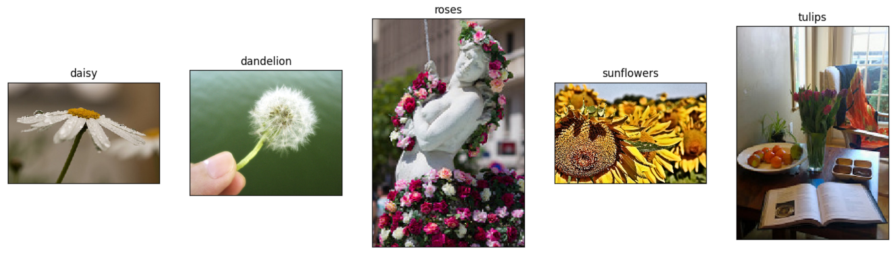

# This is the experiment on my deep learning course
---
[Data resource of car mile regression](https://ascend-professional-construction-dataset.obs.cn-north-4.myhuaweicloud.com:443/deep-learning/auto-mpg.zip) ||[Data resource of flower recognition](https://ascend-professional-construction-dataset.obs.myhuaweicloud.com/deep-learning/flower_photos.zip) ||

## Download the dataset of car mile regression:
```
from download import download
url = " https://ascend-professional-construction-dataset.obs.cn-north-4.myhuaweicloud.com:443/deep-learning/auto-mpg.zip"  
path = download(url, "./", kind="zip", replace=True)
```
## Download the dataset of flower recognition:
```
!wget https://ascend-professional-construction-dataset.obs.myhuaweicloud.com/deep-learning/flower_photos.zip 
!unzip flower_photos.zip
```
Preview of the flowers:

## Environment
```
Python 3.7.10
Linux x86_64
mindspore 2.0.0
```


